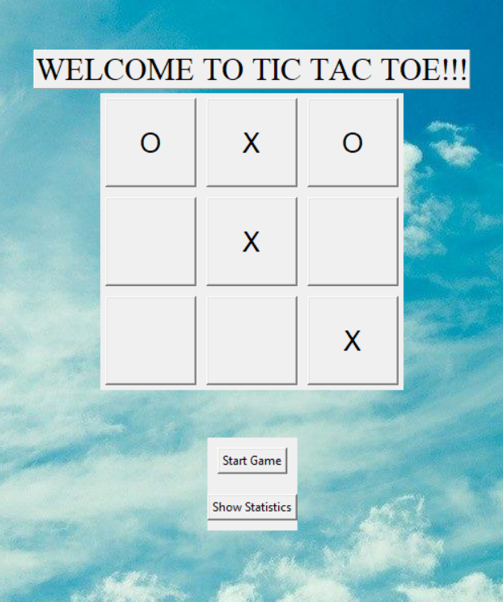

# Tic-Tac-Toe
> Tic Tac Toe is a traditional game for two participants who alternate in marking the squares on a 3x3 board. The objective is to be the first to get three of their symbols in a row, whether it be horizontally, vertically, or diagonally, to win the game. This project implements a simple Tic Tac Toe game using Python with a console-based interface.

## Table of Contents
- Installation
- Usage
- Features
- Contributing

## Installation
1. Clone the repository to your local machine:
     > git clone https://github.com/nhandang130/Tic-Tac-Toe.git
2. Navigate to the project directory:
     > cd tic-tac-toe-tkinter

## Usage
1. Run the Game:
- Open your terminal or command prompt.
- Navigate to the project directory.
- Execute the game script with:
     > python tic_tac_toe.py
2. Play the Game:
- A window with a 3x3 grid will appear.
- Player 'X' starts the game.
- Click an empty button to place your mark ('X' or 'O').
3. Game End:
- The game detects a win or a draw automatically.
- A message box announces the result.
- The board resets for a new game after each round.
## Features
- **Graphical User Interface:** Built with Tkinter, making it user-friendly and visually appealing.
- **Automatic Win Detection:** Detects and announces the winner or if the game ends in a draw.
- **Easy to Play:** Simply click on the buttons to play your turn.
## Hopefully you enjoy the game!

Dang Thi Thanh Nhan
